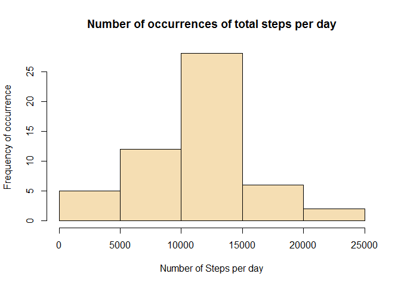
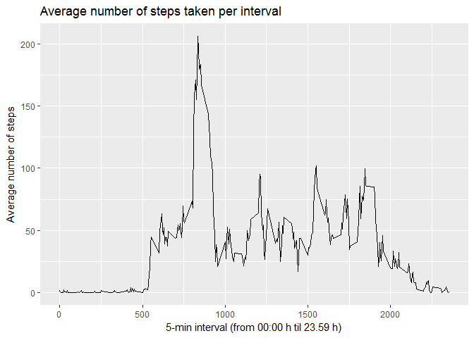
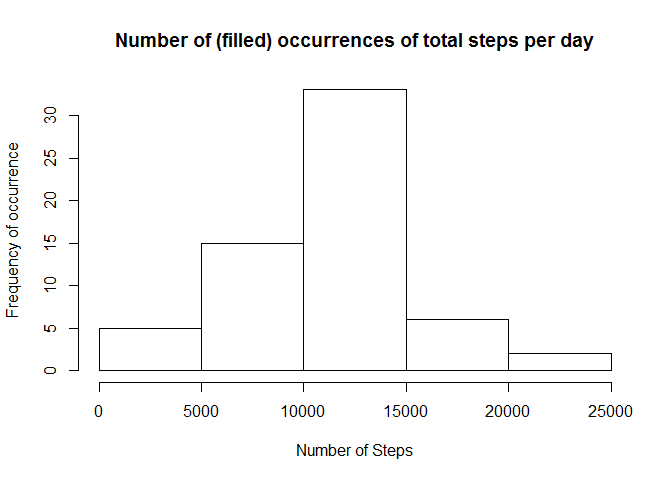
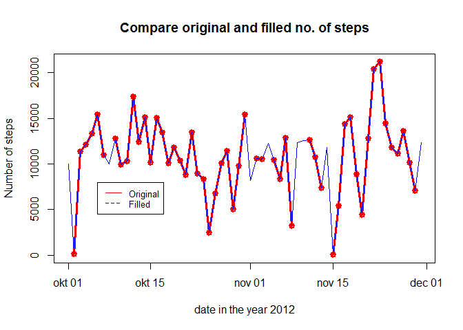
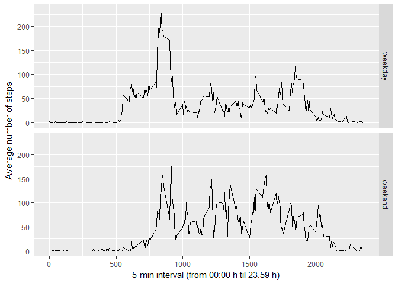

# PA1_template
Marlein  
31 mei 2017  
This assignment from week 2 of the course "Reproducible Research" of Coursera makes use of data from a personal activity monitoring device. This device collects data at 5 minute intervals through out the day. The data consists of two months of data from an anonymous individual collected during the months of October and November, 2012 and include the number of steps taken in 5 minute intervals each day.

Setting work directory and loading ggplot2 and dplyr.  


```r
setwd("C:/Users/marle_000/Documents/Documents/Datasciencecoursera/5 Reproducible Research/Week 2/PA1_github")  
library(ggplot2)   
library(dplyr)
```

The data for this assignment can be downloaded from the course web site:
https://d396qusza40orc.cloudfront.net/repdata%2Fdata%2Factivity.zip
I downloaded is on 2017-5-29 at 11:15h (CMT+1)


```r
download.file("https://d396qusza40orc.cloudfront.net/repdata%2Fdata%2Factivity.zip", "activity.zip")  
activitydir <- getwd()  
unzip("activity.zip", exdir=activitydir)  
```

For your information I include the systems-info for you, but for easy reading, this information will be stated at 
the end of this document.


###1. Code for reading in the dataset and/or processing the data 
Reading in the data and checking if `act_data` consists of 17,568 rows and three columns mentioned.


```r
act_data <- read.csv("activity.csv", na.strings = "NA")
str(act_data)
```

```
## 'data.frame':	17568 obs. of  3 variables:
##  $ steps   : int  NA NA NA NA NA NA NA NA NA NA ...
##  $ date    : Factor w/ 61 levels "2012-10-01","2012-10-02",..: 1 1 1 1 1 1 1 1 1 1 ...
##  $ interval: int  0 5 10 15 20 25 30 35 40 45 ...
```


###2. Histogram of the total number of steps taken each day.
To be able to make a histogram of the total steps taken each day,it is necessary to calculate the total number of steps taken per day. With this new dataset `totalstepsperday` there will be made an histogram.


```r
groupdays <- group_by(act_data, date)
totalstepsperday <- summarise(groupdays, stepsperday=sum(steps))
totalstepsperday$date <- as.Date(totalstepsperday$date)
hist(totalstepsperday$stepsperday, xlab="Number of Steps per day", ylab="Frequency of occurrence", main="Number of occurrences of total steps per day", col = "wheat", border = "black") 
```

<!-- -->


###3 Mean and median number of steps taken each day.  
The dataset `totalstepsperday` can be used for these calculations.


```r
meanstepsperday <- round(mean(totalstepsperday$stepsperday, na.rm = TRUE),2)
print(paste("The mean steps per day is ", meanstepsperday))
```

```
## [1] "The mean steps per day is  10766.19"
```


```r
medianstepsperday <- median(totalstepsperday$stepsperday, na.rm = TRUE)
print(paste("The median steps per day is ", medianstepsperday))
```

```
## [1] "The median steps per day is  10765"
```

These figures are in accordance with the historgram above.


###4 Time series plot of the average number of steps taken.
Make a time series plot (i.e. type = "l") of the 5-minute interval (x-axis) and the average number of steps taken, averaged across all days (y-axis).

To do this, we need a dataset that gives us the average number of steps per interval. Each interval lasts 5 minutes and the identifier is the first minute value of the time passed each day. For example, the first identifier is '0' and covers the time between 00:00 h and 00:05 h. The last interval identifier is 2355, meaning the time between 23:55 h and 00:00 h. These interval identifiers will be the scale on the x-axis. The y-axis state the average number of steps. 


```r
groupsinterval <- group_by(act_data, interval)
meanperinterval <- aggregate(steps ~ interval, data = act_data, FUN = mean, na.rm = TRUE)
qplot(interval, steps, data=meanperinterval, geom="line", main ="Average number of steps taken per interval", xlab ="5-min interval (from 00:00 h til 23.59 h)", ylab="Average number of steps")
```

<!-- -->

### 5 Which 5-minute interval, on average across all the days in the dataset, contains the maximum number of steps? 


```r
meanperinterval[which.max(meanperinterval$steps), ]
```

```
##     interval    steps
## 104      835 206.1698
```

So the maximum average number of steps per interval are made between 08:35h and 08:40h and contain a little more than 206 steps.


###6 Code to describe and show a strategy for imputing missing data.
Note that there are a number of days/intervals where there are missing values (coded as NA). The presence of missing days may introduce bias into some calculations or summaries of the data. 

####6.1 Calculate and report the total number of missing values in the dataset (i.e. the total number of rows with NAs) 

```r
numberofna <- sum(is.na(act_data$steps))
percentagena <- round((numberofna / length(act_data$steps) *100), 2)
print(paste("There are",numberofna, "intervals with a value NA, which is", percentagena,"% of the total number of observations."))
```

```
## [1] "There are 2304 intervals with a value NA, which is 13.11 % of the total number of observations."
```


####6.2 Devise a strategy for filling in all of the missing values in the dataset.  

The strategy that I want to follow is based on the assumption that the daily activities are in line with the weekdays in combination with the interval. So, on average, we do the same things in the same order on mondays that differs from sundays. So each weekday has its own average number of steps per interval. 

####6.3 Create a new dataset that is equal to the original dataset but with the missing data filled in. 
So I have to alter the dataset and add the weekdays to each observation and next the weekday-interval combination. Then I will calculate the average number of steps per weekday-interval combination and use this to fill in the NA's in the original dataset. Because I am in Holland, the name of the weekdays will be in Dutch. 


```r
activity_weekdays <- act_data
activity_weekdays$date <- as.Date(activity_weekdays$date)
activity_weekdays <- mutate(activity_weekdays, weekday = weekdays(date))
activity_weekdays <- mutate(activity_weekdays, intervalday = paste(weekday, interval))
activity_weekdays$intervalday <- as.factor(activity_weekdays$intervalday)
activity_weekdays <- group_by(activity_weekdays, intervalday)
mean_interval_day <- summarise(activity_weekdays, mean_per_intervalday = mean(steps, na.rm=TRUE))
```

So the dataset `mean_interval_day` looks like this:


```r
str(mean_interval_day)
```

```
## Classes 'tbl_df', 'tbl' and 'data.frame':	2016 obs. of  2 variables:
##  $ intervalday         : Factor w/ 2016 levels "dinsdag 0","dinsdag 10",..: 1 2 3 4 5 6 7 8 9 10 ...
##  $ mean_per_intervalday: num  0 0 0 25.6 0 ...
```

Next I want all these values in a new column in addition the original data `act_data`. First I copy this data to `activity`, so the original dataset will remain intact. Then I mutate it to make a column where the average per intervalday will be stated if the number of steps is NA, otherwise the original number of steps will be stated. To do this I consider the variable 'intervalday' the key for merging, so first I make the new column 'intervalday' in the original dataset `activity` and than merge it with the `mean_interval_day` dataset.


```r
activity <- act_data
activity$date <- as.Date(activity$date)
activity <- mutate(activity, weekday = weekdays(date))
activity <- mutate(activity, intervalday = paste(weekday, interval))
activity$intervalday <- as.factor(activity$intervalday)
filled_activity <- merge(activity, mean_interval_day, by = "intervalday")
filled_activity <- mutate(filled_activity, filled_steps = ifelse(is.na(filled_activity$steps), mean_per_intervalday, steps))
str(filled_activity)
```

```
## 'data.frame':	17568 obs. of  7 variables:
##  $ intervalday         : Factor w/ 2016 levels "dinsdag 0","dinsdag 10",..: 1 1 1 1 1 1 1 1 1 2 ...
##  $ steps               : int  0 0 0 0 0 0 0 0 0 0 ...
##  $ date                : Date, format: "2012-11-20" "2012-10-30" ...
##  $ interval            : int  0 0 0 0 0 0 0 0 0 10 ...
##  $ weekday             : chr  "dinsdag" "dinsdag" "dinsdag" "dinsdag" ...
##  $ mean_per_intervalday: num  0 0 0 0 0 0 0 0 0 0 ...
##  $ filled_steps        : num  0 0 0 0 0 0 0 0 0 0 ...
```

###7 Histogram of the total number of steps taken each day etc.

The assignment states: Make a histogram of the total numbers of steps taken each day and calculate and report the mean and median total number of steps taken per day. Do these values differ from the estimates from the first part of the assignment? What is the impact of imputing missing data on the estimates of the total daily number of steps? 

To make the histogram I perform the same calculations as stated above, but now for `filled_activity`.


```r
group_filled_activity <- group_by(filled_activity, date)
totalstepsperfilledday <- summarise(group_filled_activity, stepsperday=sum(filled_steps))
hist(totalstepsperfilledday$stepsperday, xlab="Number of Steps", ylab="Frequency of occurrence", main="Number of (filled) occurrences of total steps per day") 
```

<!-- -->

Next I calculate the mean and median on `totastepsperfilledday`.


```r
meanfilled <- round(mean(totalstepsperfilledday$stepsperday), 2)
dffrmean <- round(meanfilled - meanstepsperday, 0)
medianfilled <- median(totalstepsperfilledday$stepsperday)
print(paste("The mean of the filled data is", meanfilled, "while the origignal mean was", meanstepsperday,"So it increased with", dffrmean, "steps. The median is now", medianfilled, "and was original", medianstepsperday, "."))
```

```
## [1] "The mean of the filled data is 10821.21 while the origignal mean was 10766.19 So it increased with 55 steps. The median is now 11015 and was original 10765 ."
```

To see more clearly what the difference is with the dataset 'totalstepsperday' I made a graphic to show this, because one picture says more than a thousand words, isn't that true?


```r
plot(totalstepsperday$date, totalstepsperday$stepsperday,type = "o", lwd = 3,col = "red", xlab = "date in the year 2012", ylab = "Number of steps", main = "Compare original and filled no. of steps")
lines(totalstepsperfilledday$date, totalstepsperfilledday$stepsperday,type = "l", lwd = 1,col = "blue")
legend(totalstepsperday[6,1], 8000, legend=c("Original", "Filled"), col=c("red", "blue"), lty=1:2, cex=0.8)
```

<!-- -->


So in the plot the red line are the original data, while the blue line represents the filled data. At some points in the graph, the red line is missing. This were the days where all orogonal variables were NA's. The blue lines are visible in these spots, because the filling-in has overwritten all NA's. Furthermore there are no real deviations between the red (original) an blue (filled) lines, so the method to fill in matches pretty closely the original pattern.

###8 Panel plot comparing the average number of steps taken per 5-minute interval across weekdays and weekends.
The pale plot should give an answer to wether the activity patterns in weekdays differ from that in weekends. So to do this, I need a dataset with weekdyas-intervals and weekend-intervals. In `filled_activity` there is already the weekday stated, so I use this to build on it. I will add the column weekday_weekend so I can make a two panel time series plot.


```r
filled_activity<- mutate(filled_activity, weekday_weekend = ifelse(filled_activity$weekday == "zaterdag" | filled_activity$weekday == "zondag", "weekend", "weekday" ))
filled_activity$weekday_weekend <- as.factor(filled_activity$weekday_weekend)
meaninterval_weekday_weekend <- aggregate(steps ~ interval + weekday_weekend, data=filled_activity, mean)
ggplot(meaninterval_weekday_weekend, aes(interval, steps)) + geom_line() + facet_grid(weekday_weekend ~ .) + xlab("5-min interval (from 00:00 h til 23.59 h)") + ylab("Average number of steps")
```

<!-- -->

So these two plots shows that in weekends, activity (number of steps taken) starts a little later than on weekdays.


###9 Session info.
As promised here is the session information.


```r
sessionInfo()
```

```
## R version 3.3.3 (2017-03-06)
## Platform: x86_64-w64-mingw32/x64 (64-bit)
## Running under: Windows 8.1 x64 (build 9600)
## 
## locale:
## [1] LC_COLLATE=Dutch_Netherlands.1252  LC_CTYPE=Dutch_Netherlands.1252   
## [3] LC_MONETARY=Dutch_Netherlands.1252 LC_NUMERIC=C                      
## [5] LC_TIME=Dutch_Netherlands.1252    
## 
## attached base packages:
## [1] stats     graphics  grDevices utils     datasets  methods   base     
## 
## other attached packages:
## [1] dplyr_0.5.0   ggplot2_2.2.1
## 
## loaded via a namespace (and not attached):
##  [1] Rcpp_0.12.10     knitr_1.16       magrittr_1.5     munsell_0.4.3   
##  [5] colorspace_1.3-2 R6_2.2.0         stringr_1.2.0    plyr_1.8.4      
##  [9] tools_3.3.3      grid_3.3.3       gtable_0.2.0     DBI_0.6-1       
## [13] htmltools_0.3.6  yaml_2.1.14      lazyeval_0.2.0   rprojroot_1.2   
## [17] digest_0.6.12    assertthat_0.2.0 tibble_1.3.0     reshape2_1.4.2  
## [21] evaluate_0.10    rmarkdown_1.5    labeling_0.3     stringi_1.1.5   
## [25] scales_0.4.1     backports_1.1.0
```

End of document
